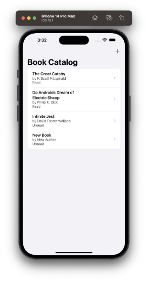

# Book Catalog
An iOS 15+ Core Data app that lets a user store books to a persistent catalog. Made to demonstrate the CRUD capabilities of SwiftUI and Core Data.

    

Final project for Mizzou's IT 4405: iOS App Dev class.

*Project tasks and resources provided by Dale Musser*
